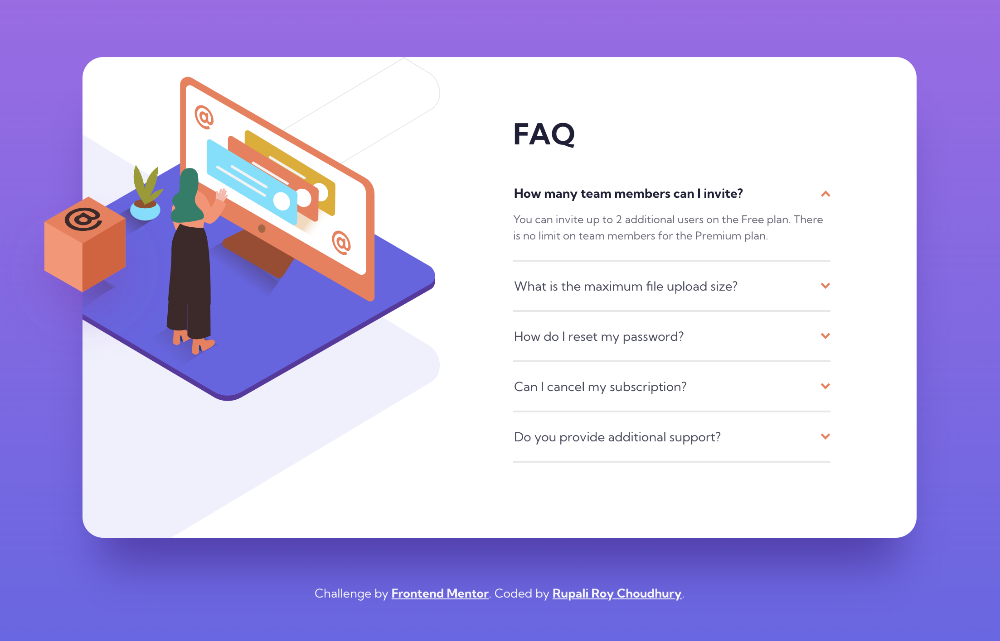
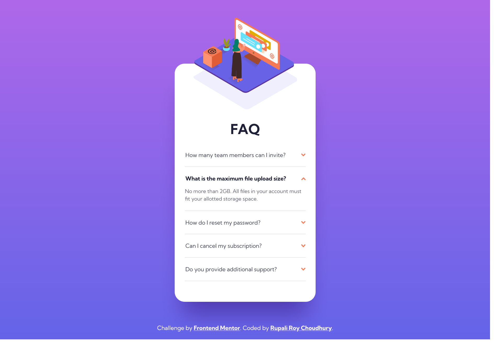
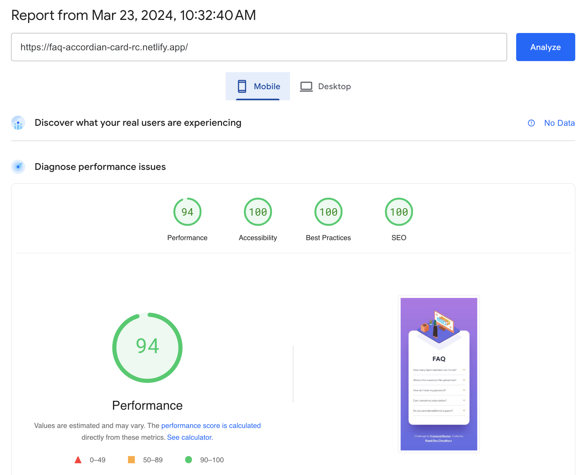
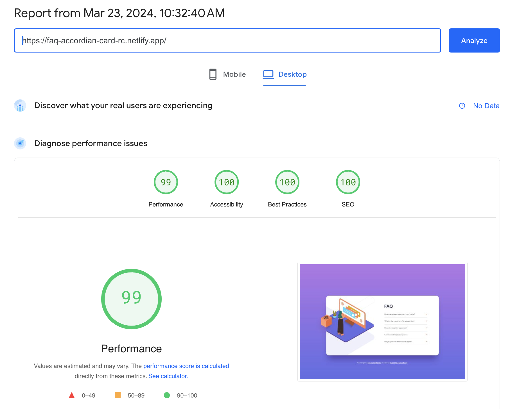

# Frontend Mentor - Results summary component solution

This is a solution to the [FAQ accordion card challenge on Frontend Mentor](https://www.frontendmentor.io/challenges/faq-accordion-card-XlyjD0Oam). Frontend Mentor challenges help you improve your coding skills by building realistic projects. 

## Table of contents

- [Overview](#overview)
  - [The challenge](#the-challenge)
  - [Screenshots](#screenshots)
  - [PageSpeed Insights results](#pagespeed-insights-results)
  - [Links](#links)
- [My process](#my-process)
  - [Built with](#built-with)
  - [Tested with](#tested-with)
  - [What I learned](#what-i-learned)
  - [Continued development](#continued-development)
  - [Useful resources](#useful-resources)
- [Author](#author)
- [Acknowledgments](#acknowledgments)

## Overview

### The challenge

Users should be able to:

- View the optimal layout for the component depending on their device's screen size.
- See hover states for all interactive elements on the page.
- Hide/Show the answer to a question when the question is clicked.

### Screenshots

##### 1. Desktop version

##### 2. Mobile version

### PageSpeed Insights results

[Mobile version](https://pagespeed.web.dev/analysis/https-faq-accordian-card-rc-netlify-app/624sa3dq6f?form_factor=mobile)

[Desktop version](https://pagespeed.web.dev/analysis/https-faq-accordian-card-rc-netlify-app/624sa3dq6f?form_factor=desktop)

### Links

- Solution URL: [FAQ accordian card Github link](https://github.com/rupali317/faq-accordion-card-main)
- Live Site URL: [FAQ accordian card live URL](https://faq-accordian-card-rc.netlify.app/)

## My process

### Built with

- Semantic HTML5 markup
- CSS custom properties
- Flexbox
- Mobile-first workflow
- [React](https://reactjs.org/) - JS library
- [Styled Components](https://styled-components.com/) - For styles

### Tested with

- Browsers used for testing: Google Chrome, Firefox, Safari, Brave, Microsoft Edge
- Devices:
  - (Real) MacBook Pro (15 inch), Samsung Galaxy A33 5G, Samsung Galaxy S20+, iPad Air 2
  - (Virtual) The mobile and tablet devices mentioned under Chrome's dev console
- Screen reader: MacOS VoiceOver

### What I learned

- Initially, my go-to-approach was to implement using Javascript. However, when the challenge mentioned that the final result can be achieved without Javascript, I decided to explore more semantic elements and that was when I learnt about the `<detail>` tag.

### Continued development

- Attempt this challenge using Javascript.
- I think the handling of the images can be improved since currently there is a fixed width and height for those images. Additionally, explore better ways to position the images.
- Find out why screen reader like MacOS Voiceover does not read the expanded content when the accordian is expanded.

### Useful resources

- [Details HTML tag](https://developer.mozilla.org/en-US/docs/Web/HTML/Element/details) - This resource was especially useful when it came to reflect on how to handle the challenge without using Javascript.
- [How to modify position of detail marker](https://stackoverflow.com/questions/56758098/how-to-position-detail-marker-to-come-after-summary) - I give credit to this link as it explains how to modify the positioning of the `<detail>` marker. It gave me an idea on how to hide default marker.

## Author

- Website - [Rupali Roy Choudhury](https://www.linkedin.com/in/rupali-rc/)
- Frontend Mentor - [@rupali317](https://www.frontendmentor.io/profile/rupali317)

## Acknowledgments

- I express my gratitude towards my mentor - Deborah for the insightful code review session
